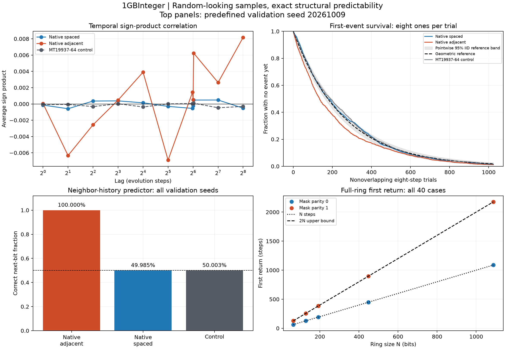

# 1GBInteger — Recorded case studies

Date: 2026-10-09 (Australia/Sydney).

**The current rule can look random under sparse sampling while remaining exactly predictable from neighboring history.**
All 32 predefined temporal runs and 40 small-ring structural cases completed.
The run suite processed 268,435,456 bits: 134,217,728 native observations and the
same number of control observations. The control ignores layout, so its two
layout runs per seed repeat the same data; they are not independent replicates.

1. [Temporal appearance and sampling geometry](01-temporal-statistics.md)
2. [Event waiting times and a discrete decay analogue](02-waiting-times.md)
3. [Exact prediction from neighboring history](03-structural-prediction.md)
4. [Perturbation propagation and a cycle bound](04-perturbation-and-period.md)



The low-order distribution results are descriptive. The exact predictor and
cycle bound follow from the recurrence and supply stronger structural evidence.
No genuine quantum equivalence or physical radioactive-decay model is established.
As [NIST explains](https://csrc.nist.gov/pubs/sp/800/22/r1/upd1/final), statistical
testing cannot by itself certify a random generator.

## Reproduction and evidence

- [Protocol recorded before collection](PROTOCOL.md)
- [Every run's scalar measurements](summary.csv)
- [Detailed derived data](summary.json), including survival and hazard curves
- [Source/executable hashes, commands and output hashes](manifest.json)
- [Native raw counts and full-ring results](raw/)

Native executables compute all observations and diagnostic counts. Python only
orchestrates processes and analyzes the saved aggregate counters. Each worker
keeps two bounded observation windows, not the full integer or whole population
history. The source fixes the observed bit at zero for an explicit spatial
comparison; this is different from the throughput benchmark's j modulo 64 bit mapping.

All native counters were independently checked against a small fully evolved
state, and exact results were verified across 1, 2, 3, and 16 requested threads.
The existing temporal and lazy correctness suites remain separate checks.

```powershell
clang++ -O3 -std=c++17 -pthread temporal_experiments.cpp -o temporal_experiments.exe
clang++ -O3 -std=c++17 -pthread structural_experiments.cpp -o structural_experiments.exe
python run_experiments.py
python analyze_experiments.py
# Optional standalone charts: install matplotlib, then
python analyze_experiments.py --plots
python test_experiments.py
```

On Linux omit `.exe` from output names. The lab regression test also requires
the full and lazy executables described in the main README. Raw counts reproduce
exactly; runtime, platform metadata, and executable hashes may differ by compiler
and operating system. The manifest records the pre-change base commit plus exact
source hashes, because data collection preceded the commit containing these studies.

Native instrumented-run timings are saved for provenance, not presented as a
new throughput benchmark: each configuration was run once and the timings are short.
These runs include statistics collection and cannot be compared directly to the
aggregate-only performance benchmark.

## Implication for further work

Retain this recurrence as an exact baseline. A more expressive model would need
a separately specified transition and observation law with independently tested
predictions. Adding nonlinear mixing may remove these particular shortcuts but
could also invalidate sparse evaluation; it would still require a physical model
and evidence, rather than just better-looking random-number statistics.
