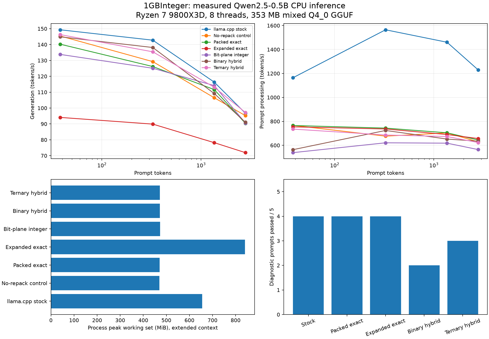

# Case study 11 — Real Qwen inference with packed integer kernels

## Decision

Keep **stock llama.cpp as the default**. The experiments establish working real-model integration and exact integer alternatives, but do not establish a robust end-to-end speedup over the optimized stock engine. Binary/ternary replacement of one FFN up projection changes the pretrained model and produces measurable quality regressions. These approximate paths remain opt-in research cases.

The pretrained Qwen2.5-0.5B-Instruct mixed Q4_0 GGUF is **352,972,352 bytes**, close to the requested 300 MB target. CPU-only on Windows 11, Ryzen 7 9800X3D (8 cores / 16 logical processors, 96 MiB L3), Clang 22.1.8 with native ISA selection. The RTX 5080 is not used. No training or fine-tuning.

## Matched actual inference

Warm model, greedy selection, F16 KV cache, no GPU layers, identical prompt IDs within each workload, fixed output length including any EOS continuation. Three repetitions per configuration. Model load, one-time packing and warm-up are outside inference timing and recorded separately. Peak RAM includes all of them. All timings are from an active desktop and are subject to interference; raw sample ranges are retained.

Representative **medium** workload (see full [measurement table](MEASUREMENTS.md) for all four prompt sizes and thread counts):

| Mode | PP tok/s | Decode tok/s | TTFT ms | Peak MiB | CPU % of machine |
|---|---:|---:|---:|---:|---:|
| stock | 1564.5 | 142.8 | 208.5 | 601.5 | 48.6 |
| control | 676.5 | 129.3 | 482.0 | 416.5 | 48.0 |
| packed | 743.7 | 126.2 | 438.5 | 416.8 | 48.4 |
| prepack | 736.5 | 89.9 | 442.8 | 786.7 | 48.7 |
| bitplane | 621.0 | 125.1 | 525.1 | 419.2 | 48.6 |
| binary | 724.1 | 138.1 | 450.3 | 418.1 | 48.4 |
| ternary | 685.9 | 135.4 | 475.4 | 418.1 | 48.4 |

`stock` enables upstream repacking; `control` disables it. All experimental modes use the same no-repack loading policy as `control`. Thus stock comparisons include that policy cost; control comparisons isolate the experimental operation more closely. Disabling repacking substantially reduces PP performance here. The exact custom modes retain upstream prompt computation and intercept single-token Q4_0 operations only.

`packed` keeps original 18-byte Q4_0 blocks and reuses Q8 activation zero-point corrections. `prepack` expands each Q4_0 block to 36 bytes once, avoiding nibble decoding but increasing memory traffic. The original 68-byte all-purpose layout is retained as `prepack-wide` for controlled comparison. Thread-local activation scratch keeps capacity across tokens. The current custom scheduling repeats activation packing per worker; this remaining overhead is measured, not hidden.

## Real projection microbenchmark

First FFN up: 4,864 rows x 896 inputs. Weights are from the real GGUF; the activation is captured from the stock model on the arithmetic prompt. One thread, seven repetitions with rotating method order, five full matrix-vector evaluations per timed sample. This is a warm small-matrix test, not full-model throughput. All output rows contribute to error statistics; results are retained to prevent dead-code elimination.

| Kernel | Median matrix-vector ms | Relative to upstream | Max output error vs upstream |
|---|---:|---:|---:|
| upstream | 0.1015 | 1.00x | 0 |
| packed | 0.1508 | 0.67x | 0 |
| expanded | 0.0848 | 1.20x | 0 |
| bitplane | 0.8868 | 0.11x | 2.38419e-07 |
| binary | 0.2673 | 0.38x | 1.21253 |
| ternary | 0.3266 | 0.31x | 0.716562 |
| packed-call | 0.4379 | 0.23x | 0 |

Expanded weights can win in this cache-resident kernel test while losing at model scale. The bit-plane path requires 32 population-count intersections for each 32-value Q4 x Q8 block; binary and ternary variants need fewer intersections but approximate weights. Hardware vector integer multiply-accumulate already performs many products per instruction. The previous 16.51x synthetic bipolar-dot result does not transfer to this pretrained quantized model.

## Assembly-driven iteration

The first packed kernel called `ggml_fp16_to_fp32` inside every block iteration. Disassembly showed a call, `vzeroupper`, and accumulator spills. The revised path uses inline F16C conversion and has no calls in that loop. Both paths remain available (`packed-call`, `packed`) and use identical integer arithmetic and loading policy. Native disassembly also confirms VNNI dot instructions and vector population counts; AVX2 multiply-add is the fallback. No handwritten assembly was needed. [Bounded assembly excerpts](assembly-excerpts.txt) and [instruction audit](assembly.json) record the evidence.

Controlled whole-model tuning runs rotate six methods across five independent processes, each with warm-up and a fixed 96-token generation budget:

| Variant | Median decode tok/s | Extra packed MiB |
|---|---:|---:|
| stock | 162.5 | 0.0 |
| control | 148.0 | 0.0 |
| packed-call | 93.4 | 0.0 |
| packed | 146.1 | 0.0 |
| prepack-wide | 58.2 | 698.7 |
| prepack | 95.5 | 369.9 |

A speedup over an earlier experimental implementation is not a speedup over stock llama.cpp. None of these slower variants replaces the default.

## Numerical fidelity

Five diagnostic prompts, 48 steps each, identical **stock token history** replayed through each variant. Full logits (151,936 vocabulary entries per step) and softmax probabilities are compared, plus last-position FFN and residual block outputs for prefill and the first decode step. Layer dump files and logits stay local; their hashes and numerical reductions are committed. Instrumented trace timings are excluded from the performance table.

| Mode | Max logit error vs control | Max logit error vs stock | Mean top-1 agreement vs stock | Mean KL(stock || mode), nats |
|---|---:|---:|---:|---:|
| control | 0 | 2.60266 | 99.17% | 0.00263138 |
| packed | 0 | 2.60266 | 99.17% | 0.00263138 |
| prepack | 0 | 2.60266 | 99.17% | 0.00263138 |
| bitplane | 2.59923 | 2.42648 | 97.08% | 0.00362952 |
| binary | 17.0006 | 17.3504 | 81.25% | 0.322398 |
| ternary | 15.6647 | 16.0014 | 87.50% | 0.236806 |

The integer transformations are exact relative to their Q4/Q8 codes, not relative to original FP16 model weights. **Packed and expanded SIMD paths match the control logits and traced layers bit for bit in this suite.** The bit-plane path changes floating-point reduction order: its isolated projection error is tiny, but its full-model logit difference reaches about 2.60 and it fails strict model-output conformance. Changed reductions feeding subsequent quantization can amplify perturbations; the exact causal contribution was not isolated here. This path is rejected as a drop-in numerical replacement despite its correct integer dots. Stock repacking also differs numerically from the no-repack control and is reported separately. No full integer-only attention or transformer claim is made.

Maximum observed layer-output differences versus the no-repack control (FFN outputs and residual states):

| Mode | Max absolute layer difference |
|---|---:|
| packed | 0 |
| prepack | 0 |
| bitplane | 0.711994 |
| binary | 10.8425 |
| ternary | 6.32798 |

## Free-running quality

These five fixed prompts are a diagnostic set, not a general accuracy benchmark. Scoring: correct arithmetic answer, Paris for the factual question, exact requested colour string, complete Python AST implementing `add(a,b)` as `return a+b`, and exact long-conversation project code. Code is parsed, never executed. The response is truncated at its first EOS for scoring; throughput runs continue to their fixed length.

| Mode | Passed / 5 |
|---|---:|
| stock | 4 |
| packed | 4 |
| prepack | 4 |
| binary | 2 |
| ternary | 3 |

The stock model incorrectly answers **17 x 23 = 371** (correct: 391). Exact kernel paths preserve this failure; numerical conformance is not improved reasoning. Binary and ternary responses and all other full diagnostic answers are retained in [summary.json](summary.json). The binary path also loses the `ORBIT-731` recall task. The approximate paths can spend the 48-token budget on docstrings and fail to complete the requested code. This is a fixed-budget diagnostic failure, not proof that longer generation can never produce a valid function.

## Hotspots, working set and threading

Scheduler-instrumented arithmetic-prompt decode attributes **77.1%** of summed node elapsed time to matrix multiplication. This is diagnostic attribution with callback/synchronization overhead, not a hardware sampling profile. The vocabulary output projection is a prominent node. Attention, RMSNorm, RoPE, softmax and KV storage remain upstream; replacing them with XOR is not mathematically equivalent.

The read-only XOR bandwidth probe sweeps cache-sized and larger working sets. The following are medians of three runs, including worker launch/join. Each sample reads approximately 2 GiB in repeated passes. GB/s counts input bytes, not measured DRAM transactions.

| Working set MiB | 1 thread GB/s | 4 threads GB/s | 8 threads GB/s | 16 threads GB/s |
|---|---:|---:|---:|---:|
| 32 | 79.7 | 320.2 | 496.6 | 614.3 |
| 96 | 71.3 | 132.8 | 318.6 | 474.5 |
| 384 | 56.8 | 69.0 | 67.9 | 73.3 |

The model is larger than the 96 MiB L3. The expanded representation adds 387,846,144 bytes without removing original weights because prompt computation still uses them. Capacity and traffic are plausible causes of the full-model slowdown; this experiment does **not** collect hardware cache-miss or memory-controller counters, so it cannot isolate their exact contribution. Thread sweeps in MEASUREMENTS.md measure scheduling/parallelism effects empirically.

## What this supports next

1. Retain stock repacking when integrating a replacement, and optimize the vocabulary Q8_0 output projection indicated by the profile. Preserve teacher-forced logits and real responses as acceptance gates.
2. If continuing Q4 work, use tiled multiple-row kernels with shared activation packing and cache-sized blocks instead of expanding all model weights. First measure against the stock packed backend, not only a disabled-repack control.
3. Treat binary/ternary conversion of pretrained weights as a quality experiment. Post-training sign replacement is not equivalent to a model trained for low-bit inference. No binary default is justified by these results.
4. CUDA and larger models are subsequent experiments. CPU results here do not establish GPU speedups or scaling.

## Reproduction and evidence

See [README](README.md) for pinned model/dependency setup and commands. [manifest.json](manifest.json) binds source, model, executable, raw data and derived reports. `check_results.py` validates committed evidence without downloading weights. `test-llm-kernels` checks 104,096 independent integer-oracle cases including every Q4 by Q8 pair and signed -128. The integration fixture also exercises prompts larger than the 2,048-token batch limit by processing consecutive chunks.

