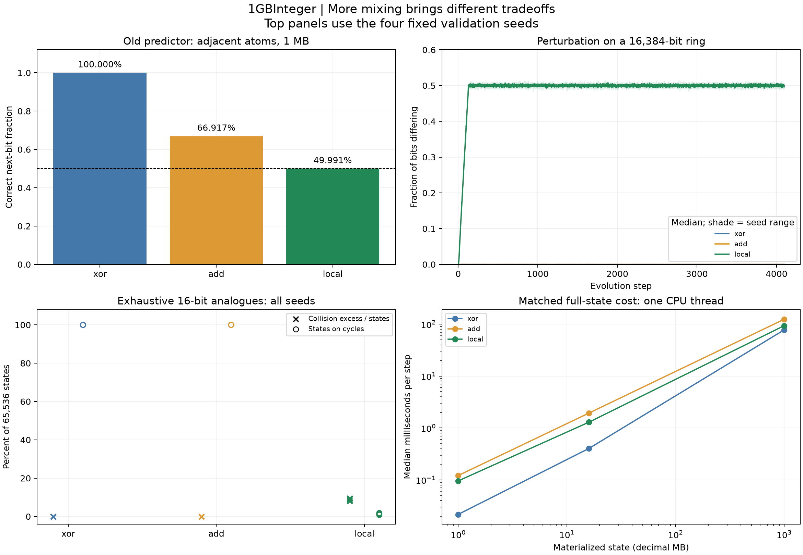

# 1GBInteger — Evolution-rule comparison

Recorded 2026-10-09. All artifacts remain under the repository's MIT Licence.

**Neither candidate is an unqualified replacement for the baseline.**
Whole-integer addition preserves information but retains a strong form of the
old predictability and weak perturbation spreading. Local nonlinear mixing
spreads perturbations and defeats the old predictor, but its small-word
analogues lose information and funnel trajectories into short cycles.

## Case studies

5. [Temporal statistics, waiting times and prediction](05-temporal-comparison.md)
6. [Perturbation spreading, exhaustive collisions and cycles](06-structure-and-cycles.md)
7. [Matched full-state native performance](07-native-performance.md)



## Scope and evidence

- 123 native process runs: 48 temporal runs, 24 perturbation runs,
  24 exhaustive graph runs and 27 benchmark runs.
- Each temporal run measures both layouts, yielding 96 profiles and
  805,306,368 observed bits. These profiles share the same evolved state and
  are not independent replicates. Eight old control profiles are referenced,
  not counted as newly generated evidence.
- 96 perturbation trajectories, each 4,097 time points, including t=0.
- 120 exhaustive small-state graphs, totaling 1,683,840 transitions.
- Materialized benchmarks at 1 MB, 16 MB and 1 GB, with three repetitions.
- Four development and four fixed validation seeds; no candidate constants
  or event rules were tuned after collecting results.

The original baseline engine and first studies are unchanged. This experiment
uses full-state computation; it does not assume the new rules have an exact
sparse shortcut. Good distribution diagnostics are not evidence of a physical
atomic or quantum model. No isotope, physical time, energy, measurement law,
entanglement experiment, or quantum dataset is represented.

## Reproduce

```powershell
clang++ -O3 -std=c++17 rule_compare.cpp -lpsapi -o rule_compare.exe
clang++ -O2 -std=c++17 test_rule_edges.cpp -o test_rule_edges.exe
python test_rule_comparison.py
python run_rule_comparison.py
python analyze_rule_comparison.py
# Optional chart rendering, with matplotlib installed:
python analyze_rule_comparison.py --plots
```

On Linux omit `-lpsapi` and `.exe`; `getrusage` supplies process measurements.
The existing first-suite control files are required for collection/analysis.
The runner uses the same rules and settings described in the [fixed protocol](PROTOCOL.md).

[manifest.json](manifest.json) preserves collection-source hashes, executable
hash, compiler version, all commands, exact raw-output hashes and process wall
times. [analysis-provenance.json](analysis-provenance.json) records the analysis
sources and input manifest. Raw files preserve their original bytes across Git
checkouts. [derived.json](derived.json) contains full derived curves; compact
CSV summaries link back to every raw file. No optional plotting package is
required to reproduce the numerical analysis.

All three kernels pass independent Python transition and diagnostic-counter
oracles, including whole-integer carry/overflow edges. Exhaustive graphs are
cross-checked against an independent traversal; damage trajectories are
cross-checked against independent full states. Sanitized native smoke tests and
all earlier baseline regressions provide additional validation.
