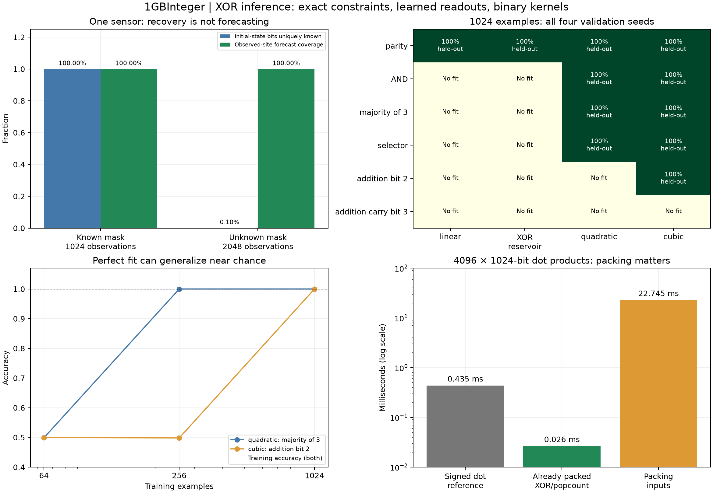

# 1GBInteger — XOR for inference

Recorded 2026-10-09. MIT Licence. This suite compares **exact hidden-state
inference**, **learned XOR readouts**, and a **packed binary inference primitive**.
It is a bounded synthetic experiment, not an LLM or physical inference claim.

## Case studies

8. [State recovery, identifiability, forecasting and noise](08-state-inference.md)
9. [Learning Boolean tasks and testing unseen inputs](09-learned-inference.md)
10. [Native learned inference and packed dot-product cost](10-native-inference-cost.md)



The native suite contains 280 state-recovery configurations, 608 learned fits
and 24 dot-product timing records. Four development and four fixed validation
seeds use the same predefined methods. No settings were tuned on validation.
The original integer engine and all previous experiment records are unchanged.

## What can be used now

- **Exact inverse/forecast engine:** solve XOR constraints, recover uniquely
  identifiable bits, and abstain on ambiguity or inconsistency. Sensor placement
  and mask knowledge are explicit. Zero noise is an assumption, not a guarantee.
- **Learned Boolean predictors:** three learned coefficient files are exported
  from development seed 0. `xor_predict` loads a model and performs inference
  without consulting the task-label generator. Nonlinear models explicitly
  compute AND features before the XOR readout.
- **Binary arithmetic primitive:** XOR/popcount exactly computes bipolar dot
  products on already-packed operands. Packing and reuse determine whether
  there is an end-to-end benefit.

```powershell
clang++ -O3 -std=c++17 xor_predict.cpp -o xor_predict.exe
.\xor_predict.exe experiments/xor-inference/models/majority.model 0 1 3 7
# Expected input,prediction rows: 0,0  1,0  3,1  7,1
.\xor_predict.exe experiments/xor-inference/models/addition-bit2.model 0 4 32 36
# Expected rows: 0,0  4,1  32,1  36,0
```

Inputs are 16-bit integers. `majority` uses bits 0..2. `addition-bit2` predicts
bit 2 of `(input & 7) + ((input >> 3) & 7)`. `parity` predicts the XOR of bits
0,2,5,7,11,15 and a constant one. These are learned synthetic mappings, not a
general-purpose neural network. The model format lists its feature bank/count
and packed hexadecimal coefficient words in the fixed native feature order.

## Reproduction

```powershell
clang++ -O3 -std=c++17 xor_inference.cpp -o xor_inference.exe
clang++ -O2 -std=c++17 -fsanitize=undefined -fno-sanitize-recover=all test_xor_inference.cpp -o test_xor_inference.exe
.\test_xor_inference.exe
python run_xor_inference.py
python analyze_xor_inference.py
# Optional charts (matplotlib required only here):
python analyze_xor_inference.py --plots
python test_xor_models.py
```

On Linux omit `.exe`. [PROTOCOL.md](PROTOCOL.md) fixes every configuration and
defines abstention, noise, train/test separation and timing boundaries.
[manifest.json](manifest.json) records exact source/output hashes, compiler and
the collection command. [analysis-provenance.json](analysis-provenance.json)
records the reporting sources. Raw CSVs include all failures, ranks, noise
counts, exported coefficient bitsets and scores. [summary.json](summary.json)
is a machine-readable analysis, and [models/manifest.json](models/manifest.json)
identifies each deployable model's training origin.

The GF(2) solver is tested against exhaustive enumeration of all assignments
and queries for small systems, including inconsistent and underdetermined
systems. Additional tests cover 2048-variable systems, observation equations
against materialized evolution, feature definitions, task labels and exported
model truth tables. Native loops perform training, state inference and timing;
Python orchestrates collection and validates/reports results.

## Conclusion and next boundary

XOR is useful for exact linear inference and efficient binary computation.
Increasing an affine reservoir's state size does not supply nonlinear task
capacity. Nonlinear features plus an XOR readout learn a larger class, but need
enough independent data and are not automatically robust to noise.

The next meaningful AI experiment would be a noisy real dataset with a trained
binary model and an ordinary baseline, measuring end-to-end accuracy, memory,
packing and inference cost. These synthetic results do not yet justify replacing
a conventional model or claiming language, image or general reasoning ability.
